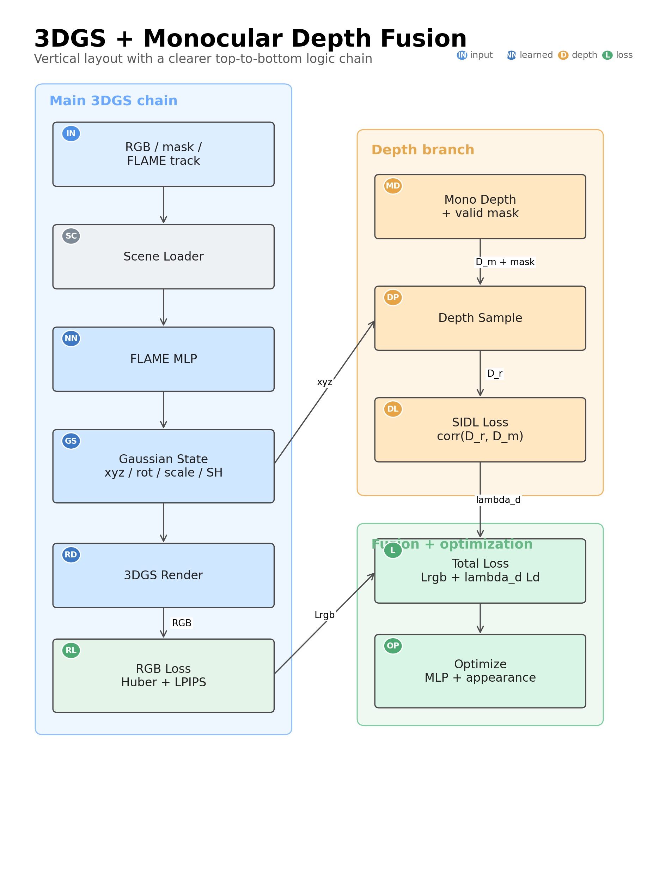
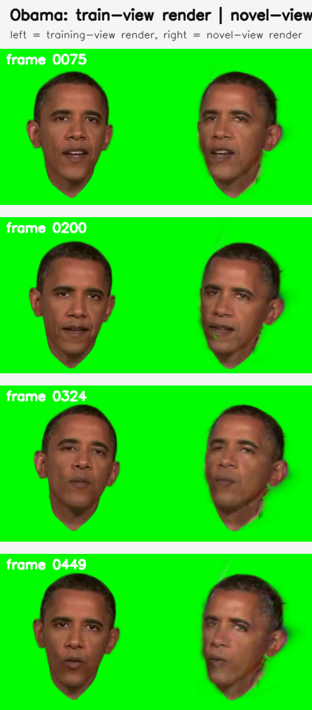
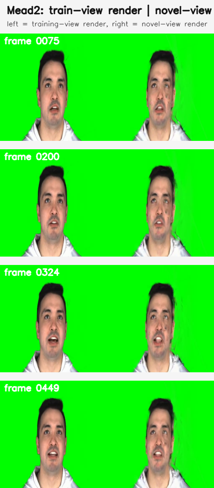
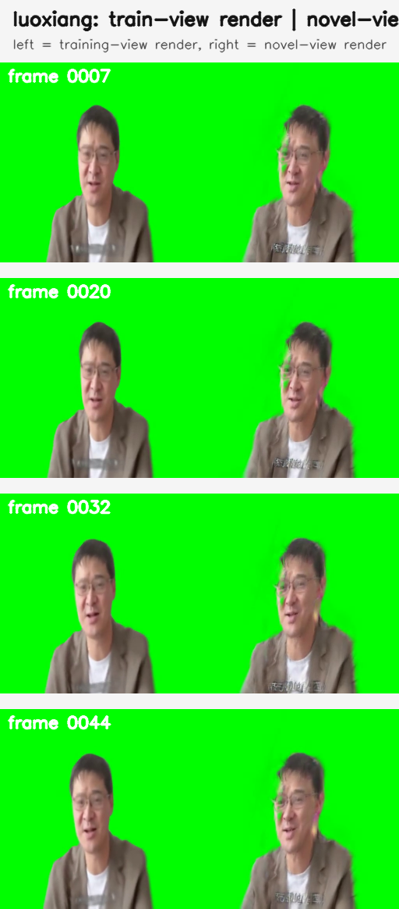

# FlashAvatar-DepthFusion

Monocular-depth-regularized FlashAvatar for head avatar reconstruction.

This repository is a public-facing research fork of FlashAvatar that adds a practical monocular depth supervision path on top of the original FLAME-conditioned Gaussian avatar pipeline.

## Project Snapshot

- Focus: stabilize geometry with monocular depth while keeping RGB reconstruction as the main learning signal
- Depth signal: per-frame VideoDepth Anything style depth maps
- Depth loss: scale-invariant Pearson correlation loss
- Safety rule: only supervise a conservative facial core, not silhouette edges or mouth interior
- Status: engineering prototype for controlled experiments, not an official upstream release

## Why This Fork Exists

RGB-only training often leaves profile geometry underconstrained. The result is usually most visible around:

- jawline and cheek depth ordering
- hair and silhouette stability
- expression-driven lower-face deformation
- side-view consistency across frames

This fork uses monocular depth as a soft regularizer instead of forcing an explicit intermediate 3D mesh fitting stage.

## What Changed Relative To FlashAvatar

- `train.py` adds optional depth supervision flags
- `Scene_mica` can load `dataset/<id>/depth/*.npy`
- a scale-invariant depth loss is implemented in `utils/loss_utils.py`
- valid-mask logic excludes risky regions before applying depth supervision
- preprocessing documents now cover `mp4 -> imgs / alpha / parsing / depth / checkpoint`

## Method Summary

Depth is not treated as a metric ground-truth target. Instead, this fork uses a correlation-based objective:

```text
L_depth = 1 - corr(render_depth[valid], mono_depth[valid])
```

The valid region is intentionally conservative:

```text
valid_depth_mask = erode(head_mask, 2~3 px) - mouth_mask
```

This protects training from the two most common failure modes of monocular depth:

- edge depth bleeding near hair, chin, ears, and silhouette boundaries
- incorrect depth inside open-mouth regions

## Architecture

The current design keeps FlashAvatar's FLAME-driven Gaussian pipeline and injects depth only as an auxiliary regularizer.



## Qualitative Comparisons

Example comparison cards generated from the current workspace:

| Identity | Result |
| --- | --- |
| Obama |  |
| Mead2 |  |
| Luoxiang |  |

## Repository Guide

- [docs/overview.md](docs/overview.md): high-level fork overview
- [docs/depth_supervision.md](docs/depth_supervision.md): depth-loss motivation and masking strategy
- [docs/preprocessing.md](docs/preprocessing.md): preprocessing contract and expected outputs
- [CONTRIBUTING.md](CONTRIBUTING.md): contribution and repository hygiene notes
- [Agents.zh-CN.md](Agents.zh-CN.md): detailed Chinese engineering notes
- [pseudocode.md](pseudocode.md): preprocessing pseudocode
- [data_schema.json](data_schema.json): machine-readable preprocessing schema

## Quick Start

Create the environment:

```bash
conda env create --file environment.yml
conda activate FlashAvatar
```

Install PyTorch3D:

```bash
conda install -c fvcore -c iopath -c conda-forge fvcore iopath
conda install -c bottler nvidiacub
conda install pytorch3d -c pytorch3d
```

Build the native extensions in your own environment if needed:

- `submodules/simple-knn`
- `submodules/diff-gaussian-rasterization`

Baseline training:

```bash
python train.py --idname <id_name>
```

Training with depth supervision:

```bash
python train.py \
  --idname <id_name> \
  --use_depth_supervision \
  --depth_loss_weight 0.05 \
  --depth_start_iter 0 \
  --depth_erode_kernel 3 \
  --min_depth_samples 256
```

Evaluation:

```bash
python test.py --idname <id_name> --checkpoint dataset/<id_name>/log/ckpt/chkpnt.pth
python novel_view.py --idname <id_name> --checkpoint dataset/<id_name>/log/ckpt/chkpnt.pth
```

## Data Layout

Each identity is expected to follow:

```text
dataset/
  <id>/
    imgs/
    alpha/
    parsing/
    depth/          # optional, required when depth supervision is enabled

metrical-tracker/
  output/
    <id>/
      checkpoint/
```

Frame alignment rule:

```text
00000.frame  <->  00001.jpg
00001.frame  <->  00002.jpg
...
```

Depth convention:

- `dataset/<id>/depth/00001.npy`
- `float32`
- same resolution and numbering as `imgs/*.jpg`
- recommended source: VideoDepth Anything

## Current Implementation Boundary

Depth-related code is already wired into:

- [train.py](train.py)
- [scene/__init__.py](scene/__init__.py)
- [scene/cameras.py](scene/cameras.py)
- [utils/loss_utils.py](utils/loss_utils.py)

The current implementation supervises depth by projecting Gaussian centers into the image plane and sampling monocular depth there. It does not yet expose a dense rasterized rendered depth map as a default renderer output.

That makes this fork lightweight to integrate, but it should still be treated as an experimental depth-regularization path rather than a benchmark-finalized release.

## Preprocessing Assets

This repository also includes preprocessing-side materials:

- [preprocess_flashavatar_mp4.py](preprocess_flashavatar_mp4.py)
- [pseudocode.md](pseudocode.md)
- [data_schema.json](data_schema.json)
- [test_flashavatar_schema.py](test_flashavatar_schema.py)
- [generate_depth_fusion_architecture.py](generate_depth_fusion_architecture.py)
- [draw_depth_fusion_flowchart.py](draw_depth_fusion_flowchart.py)
- [make_view_stability_comparison.py](make_view_stability_comparison.py)

## External Assets Not Included

For size and licensing reasons, this repository does not bundle every runtime dependency. You still need to provide:

- FLAME model assets required by `flame/`
- FLAME mask assets if your environment depends on them
- monocular depth maps if you enable depth supervision
- metrical-tracker outputs under `metrical-tracker/output/<id>/checkpoint`
- your own dataset under `dataset/<id>`

## Limitations

- This is not the official upstream FlashAvatar repository.
- Runtime still depends on CUDA, PyTorch3D, and native Gaussian rasterization extensions.
- The current depth supervision is sparse and projection-based rather than dense depth rasterization.
- Public demo assets are intentionally limited; you should expect local preparation work before training.

## Roadmap

- expose a dense rendered depth branch from the Gaussian renderer
- benchmark sparse center-projection loss against dense depth rasterization
- add a cleaner public preprocessing example
- support multi-segment identity training with segment-aware sampling

## Acknowledgements

This repository builds on:

- FlashAvatar
- 3D Gaussian Splatting
- metrical-tracker / MICA
- BiSeNet face parsing
- MatAnyone
- VideoDepth Anything

## Citation

Please cite the original FlashAvatar paper if you build on this codebase.

```bibtex
@inproceedings{xiang2024flashavatar,
  author    = {Jun Xiang and Xuan Gao and Yudong Guo and Juyong Zhang},
  title     = {FlashAvatar: High-fidelity Head Avatar with Efficient Gaussian Embedding},
  booktitle = {CVPR},
  year      = {2024}
}
```
